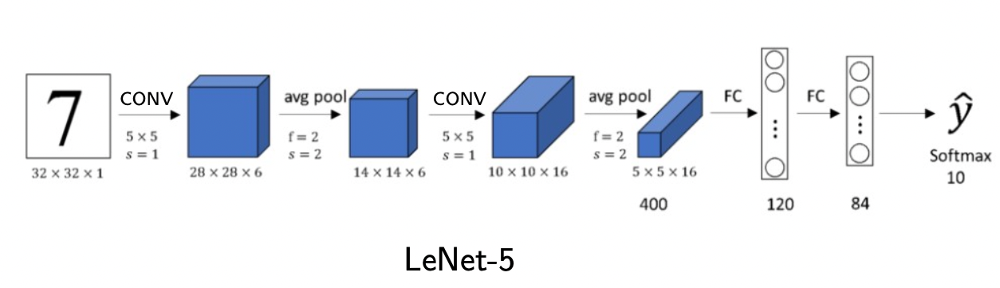

# LeNet5-MNIST-PyTorch

This program is modified from [ChawDoe/LeNet5-MNIST-PyTorch](https://github.com/ChawDoe/LeNet5-MNIST-PyTorch). I added visualization codes to visualize: 1) the outputs of intermediate layers and 2) the parameters of filters.

This is not a complete copy of [ChawDoe/LeNet5-MNIST-PyTorch](https://github.com/ChawDoe/LeNet5-MNIST-PyTorch). You can add my code **train_gpu.py** and **visual.py** to the original repository so it can work.

## Visualizing LeNet-5

Two additional codes by Ruixin Guo are added to implement LeNet-5 visualization.
1. train_gpu.py: A code modified from train.py to enable GPU acceleration. It is remarkably faster than train.py in training models.
2. visual.py: Get the hidden layer outputs and filters of LeNet-5 and transfer them into figures.

Before running train.py or train_gpu.py, you need to create a folder "models" to store the models.
```
mkdir models
```
Before running visual.py, you need to create a folder "fig" to store the generated figures.
```
mkdir fig
```

## Differences between this Pytorch LeNet-5 implementation and the LeNet-5 in original paper.
Here is the LeNet-5 model in original paper.


1. In this implementation, the parameters of fc1 layer is **256**x120 instead of 400x120. This is because the input image is 28x28 in this impletation, and the input image is 32x32 in the original paper. Then we compute the output size of each layer:
conv1    24x24x6, 
relu1    24x24x6, 
pool1    12x12x6, 
conv2    8x8x16, 
relu2    8x8x16, 
pool2    4x4x16. 
Note that by flattening the output of pool2 we get a vector of 4x4x16 = 256 length. This is why the input size of fc1 is 256.

2. The output layer is a ReLU layer instead of the softmax layer.
